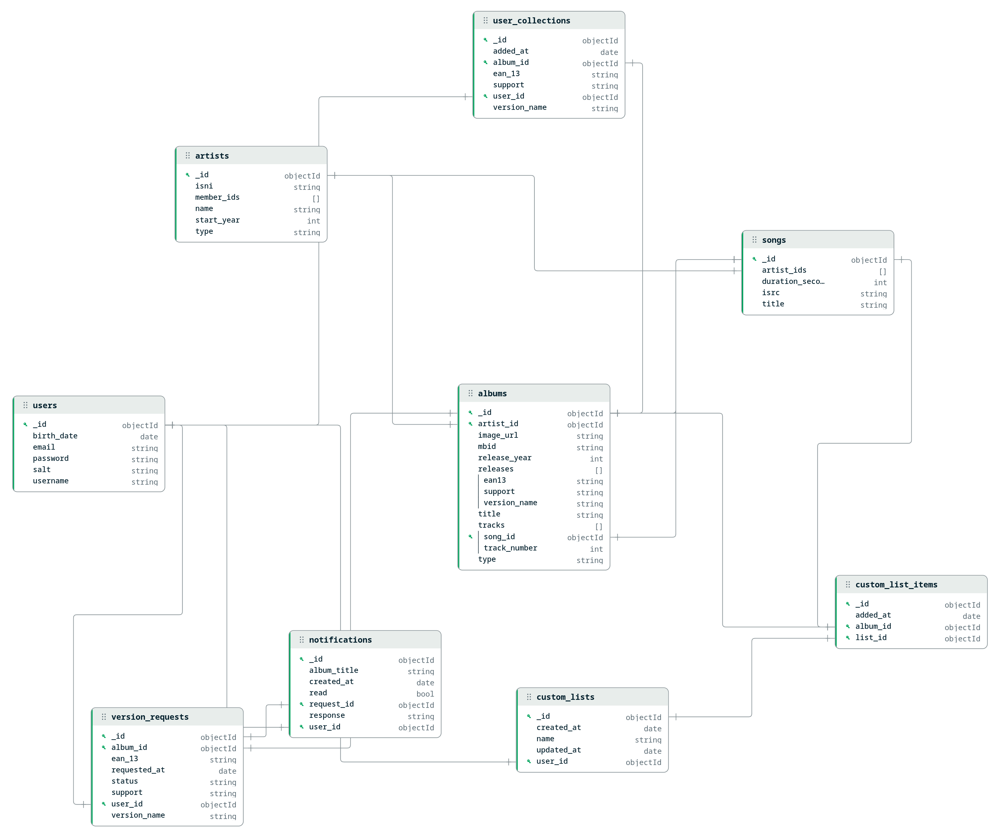

# PSI - MusicHub

Plataforma de streaming de música full-stack que permite aos utilizadores descobrir artistas, explorar álbuns e músicas, gerir o seu perfil pessoal, coleção de álbuns e pedidos de novas versões.

**Stack tecnológico:** Go backend + Angular 17 frontend + MongoDB database.

## Equipa

**Grupo 05**

| Nome | Número |
|------|--------|
| Dário Batista | 60241 |
| Diogo Chambel | 53319 |
| Daniel Horta | 61835 |
| Rafael Tomé | 60237 |

## Pré-requisitos (apenas para execução local)

- **Go** 1.22+
- **Node.js** 20+
- **MongoDB** 7+

## Configuração do Ambiente (apenas para execução local)

**Todos os scripts shell requerem um ficheiro `.env` na raiz do projeto.**

```bash
# Criar o ficheiro .env
cp .env.example .env

# Editar se necessário (os valores padrão funcionam para desenvolvimento local)
GOPATH="$PWD/.go"   # Opcional para escolher onde ficam os módulos do go
MONGODB_URI=mongodb://localhost:27017
DB_NAME=psi_db
SERVER_PORT=8080
FRONTEND_URL=http://localhost:4200
```

Os scripts **falharão com um erro** se o `.env` estiver em falta. Cada membro da equipa deve criar o seu próprio.

## Executar a Aplicação

### Docker (Mais Fácil)
```bash
./run_docker.sh          # script completo
docker compose up -d     # ou manualmente
```
Acesso: http://localhost:4200

### Desenvolvimento Local
```bash
./run_all.sh          # Backend + frontend
./run_backend.sh      # Apenas backend
./run_frontend.sh     # Apenas frontend
./run_db.sh           # Correr base de dados com docker
```

## Documentação

- [BACKEND.md](BACKEND.md) — Estrutura de diretórios, convenções e rotas da API
- [FRONTEND.md](FRONTEND.md) — Estrutura de diretórios, componentes e padrões de design



## Health Check

O backend expõe dois endpoints de monitorização:

| Endpoint | Descrição |
|----------|-----------|
| `GET /health` | Verifica se o servidor está ativo |
| `GET /health/db` | Verifica a conexão à base de dados MongoDB |

A página `/health` no frontend apresenta o estado de ambos os endpoints com auto-refresh a cada 10 segundos e lista todas as rotas da API.
